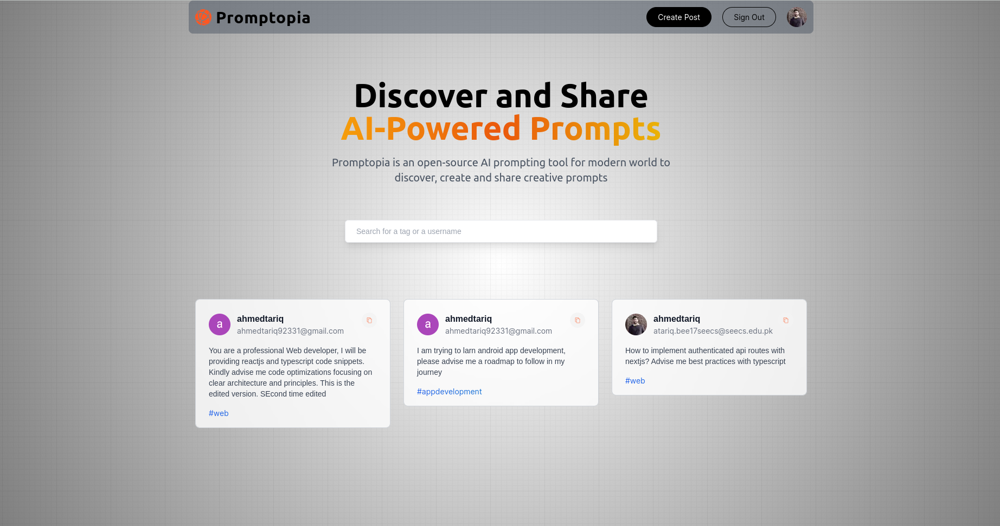
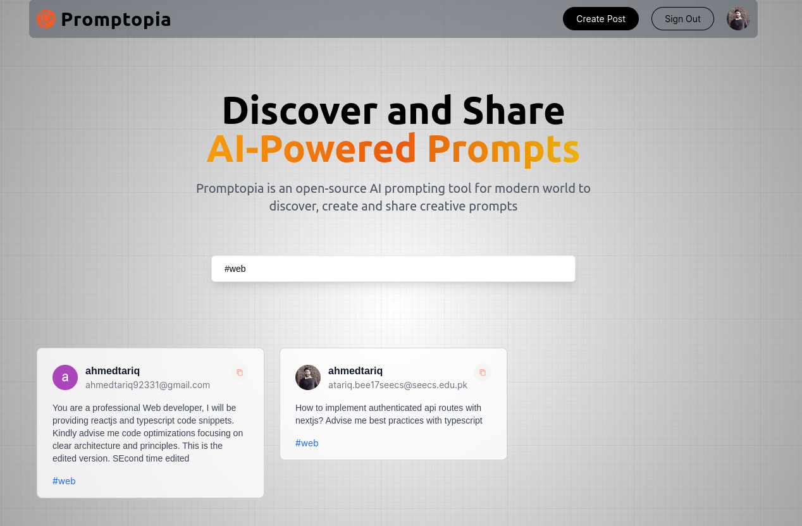
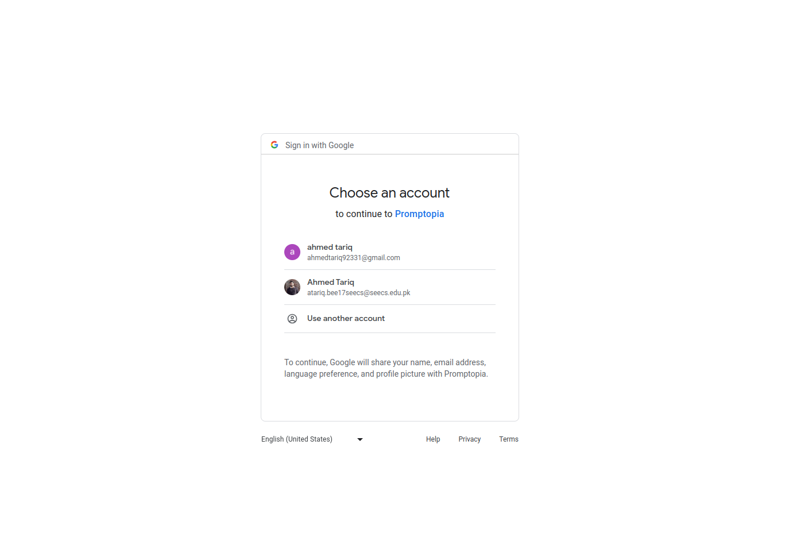
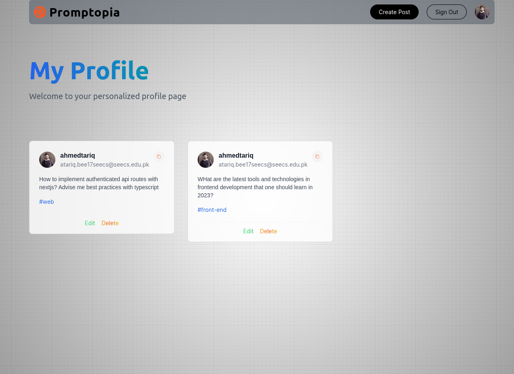
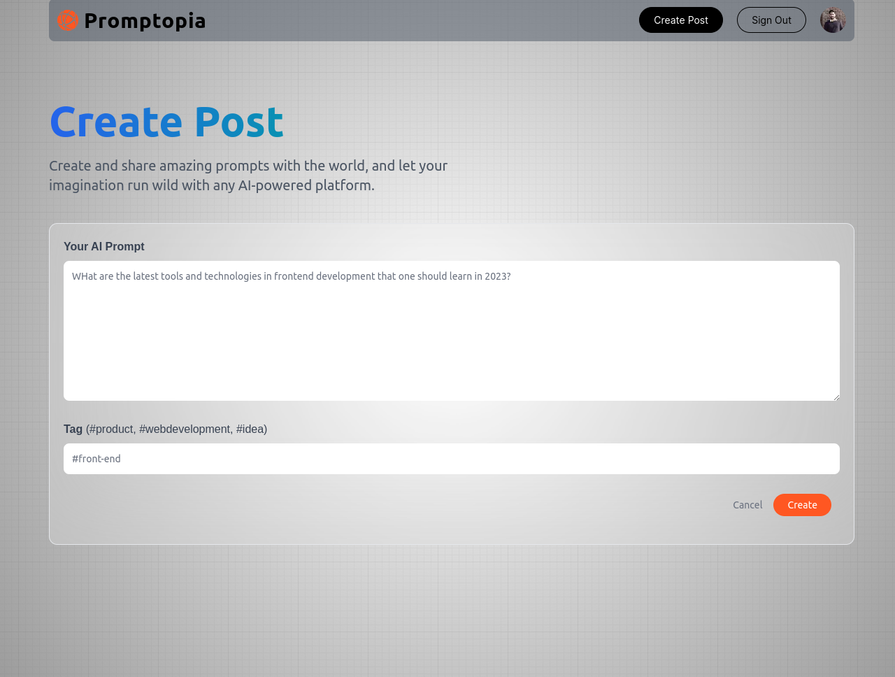
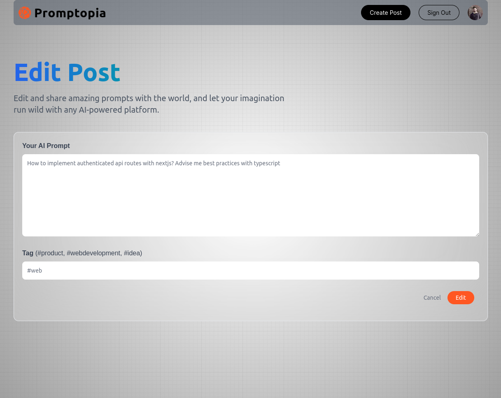

# Promptopia

## Description

**Promptopia** gives users capability to generate and use AI powered useful prompts. \
Insipiration taken from the [Jsmastery Nextjs playlist](https://www.youtube.com/watch?v=wm5gMKuwSYk&list=PL6QREj8te1P7gixBDSU8JLvQndTEEX3c3&index=3) 

## Tech Stack

This project is built using the following technologies and tools:

- **NextJs v14** 
- **ReactJs v18:**
- **Typescript:**
- **Tailwind CSS:**
- **MondoDB**
- **Next-Auth**

### How can this repo be helpful for me later?
- My first project with Nextjs
- Implementing Google authentication in Nextjs

## Demo

### Home Page
<!--  -->

&nbsp; \
**Feature - Search by prompt, tag or username** \
<!--  -->

### Google Authentication

### My Profile

### Create Post

### Edit Post

